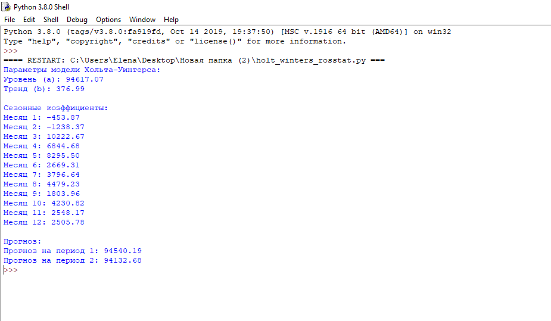

# Прогнозирование объёма погрузки грузов на железнодорожном транспорте методом Хольта–Уинтерса

## Цель работы
Целью данной работы является реализация модели тройного экспоненциального сглаживания Хольта–Уинтерса для анализа и прогнозирования временного ряда с выраженной сезонностью и трендом на основе статистических данных.

## Исходные данные
- Показатель: **объём погрузки основных видов грузов на железнодорожном транспорте**
- Источник данных: **официальная статистика (Росстат)**
- Период наблюдений: **2023–2024 годы**
- Периодичность: **месячные данные**

## Постановка задачи
В рамках работы необходимо:
- считать временной ряд из CSV-файла;
- реализовать модель Хольта–Уинтерса с аддитивной сезонностью;
- определить параметры уровня, тренда и сезонных компонентов;
- выполнить краткосрочный прогноз;
- проанализировать полученные результаты.

## Краткое описание модели
Модель Хольта–Уинтерса — это метод прогнозирования временных рядов, учитывающий:
- **уровень (level)** — текущее среднее значение ряда;
- **тренд (trend)** — направление изменения данных;
- **сезонность (seasonality)** — периодические колебания.

В данной работе используется **аддитивная сезонная модель**, применимая для временных рядов с постоянной амплитудой сезонных колебаний.

## Математическая модель

Обозначения:
- $y_t$ — фактическое значение временного ряда;
- $a_t$ — уровень ряда;
- $b_t$ — тренд;
- $s_t$ — сезонная компонента;
- $m$ — длина сезона (12 месяцев);
- $\alpha_1, \alpha_2, \alpha_3 \in (0,1)$ — коэффициенты сглаживания.

### Формулы обновления параметров:

**Уровень:**
$$a_t = \alpha_1 \cdot (y_t - s_{t-m}) + (1 - \alpha_1) \cdot (a_{t-1} + b_{t-1})$$

**Тренд:**
$$b_t = \alpha_2 \cdot (a_t - a_{t-1}) + (1 - \alpha_2) \cdot b_{t-1}$$

**Сезонность:**
$$s_t = \alpha_3 \cdot (y_t - a_t) + (1 - \alpha_3) \cdot s_{t-m}$$

### Формула прогноза:
$$\hat{y}_{t+k} = a_t + k \cdot b_t + s_{t+k-m}$$

---

## Исходный код программы
Полная реализация модели находится в отдельном файле:

👉 **[КОД](./holt_winters_rosstat.py)**

## Результаты работы программы

### Параметры модели Хольта–Уинтерса
- **Уровень (a):** 94617.07  
- **Тренд (b):** 376.99  

### Сезонные коэффициенты

| Месяц | Значение |
|------:|---------:|
| 1 | -453.87 |
| 2 | -1238.37 |
| 3 | 10222.67 |
| 4 | 6844.68 |
| 5 | 8295.50 |
| 6 | 2669.31 |
| 7 | 3796.64 |
| 8 | 4479.23 |
| 9 | 1803.96 |
| 10 | 4230.82 |
| 11 | 2548.17 |
| 12 | 2505.78 |

### Прогноз
- **Прогноз на период 1:** 94540.19  
- **Прогноз на период 2:** 94132.68  

## Экраны / скриншоты работы программы

Пример вывода программы в консоли:

## Вывод
В ходе выполнения работы была реализована модель Хольта–Уинтерса, позволяющая учитывать тренд и сезонность временного ряда. Полученная модель обеспечивает корректный краткосрочный прогноз и может быть использована для анализа экономических показателей.

